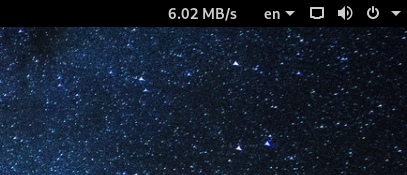

# ⇅ Internet Speed Meter

A simple and minimal Internet Speed Meter extension for the Gnome Shell.



To use this extension, you will need

- Gnome Shell 40 or later

### Install from Gnome Extensions

Visit [Internet Speed Meter - GNOME Shell Extensions](https://extensions.gnome.org/extension/2980/internet-speed-meter) 

### Install from source

1. Clone this repository

   ```bash
   git clone https://github.com/AlShakib/InternetSpeedMeter.git
   ```

2. Change current directory to repository

   ```bash
   cd InternetSpeedMeter
   ```

3. Now run

   ```bash
   chmod +x ./install.sh && ./install.sh
   ```

4. If you are using Wayland, log out and then log in. Otherwise press `ALT + F2` and then type `r` and press `Enter`.

6. Enable **Internet Speed Meter** from the [Extension Manager](https://github.com/mjakeman/extension-manager)

## Contributing

Pull requests are welcome. For major changes, please open an issue first to discuss what you would like to change.

## Thanks to

- Project Icon is made by [Freepik](https://www.flaticon.com/authors/freepik) from [www.flaticon.com](https://www.flaticon.com)

## License

[GNU General Public License v3.0](LICENSE)

Copyright © 2020 - 2022 [Al Shakib](https://alshakib.dev)
